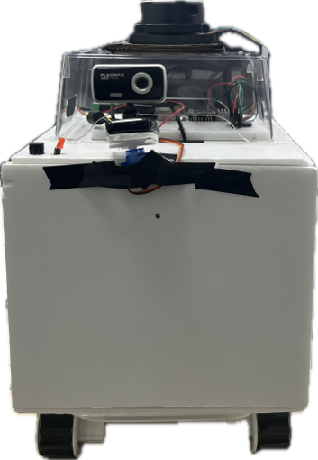
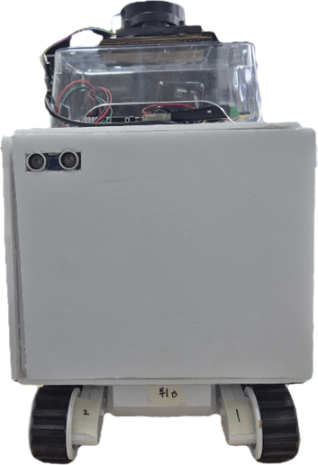
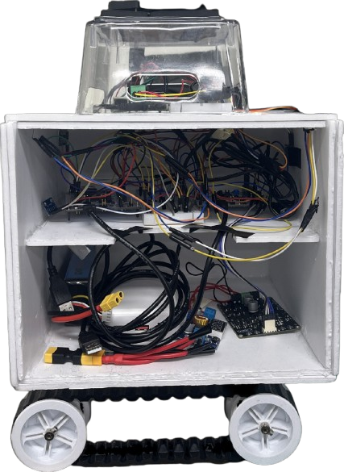
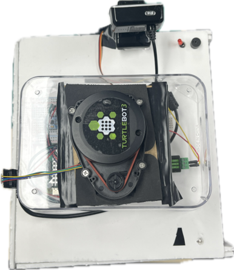
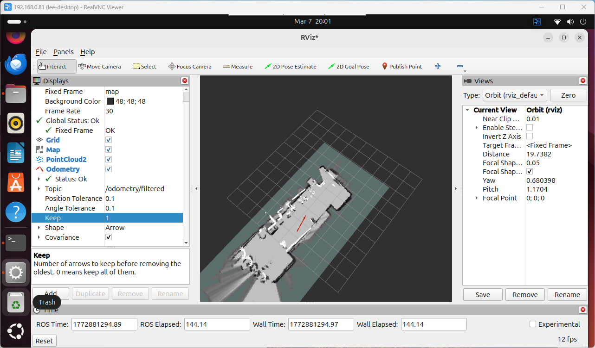
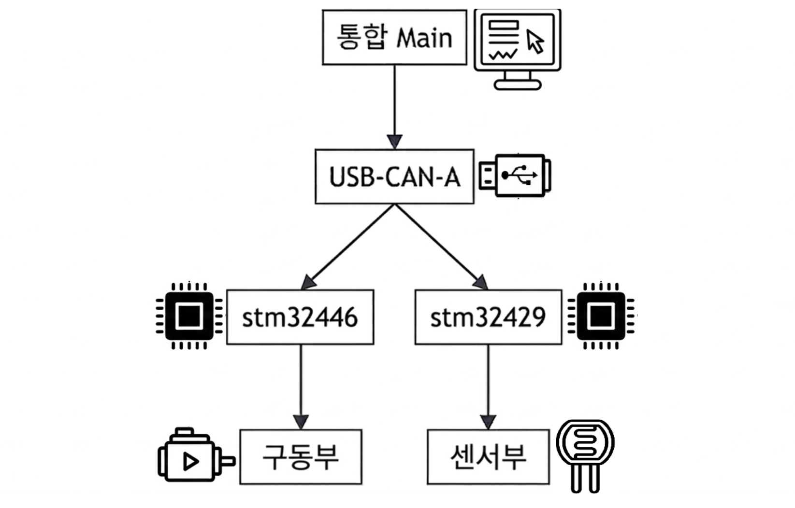

# Industrial Patrol Robot based on SLAM and CAN Network
SLAM 및 CAN 네트워크 기반 산업용 순찰 로봇

<table>
  <tr>
    <td align="center" width="25%">
      
    </td>
    <td align="center">
      
    </td>
    <td align="center">
      
    </td>
    <td align="center">
      
    </td>
  </tr>
</table>


## 🛰️ Industrial-Safety-Patrol-Mini-Project

### 🛠 개발 배경
<table>
  <tr>
    <td>
      
    </td>
    <td>
      
    </td>
  </tr>
</table>

국가데이터처 ‘산업재해 현황분석’에 따르면 산업재해자 수는 매년 증가하는 추세이며, 특히 건설업과 제조업에서 높은 비율을 차지하는 것으로 나타났습니다.

이러한 산업 현장의 안전 문제와 인력 중심 현장 감시 체계의 한계를 해결하기 위해, LiDAR 기반 SLAM과 YOLOv5 비전 기술을 결합한 자율 순찰 로봇 시스템을 개발했습니다. 

본 프로젝트는 작업자의 안전장구 착용 여부를 실시간으로 감지하여 사고를 사전에 예방하고, 상시 감시 체계를 구축함으로써 현장 안전 관리의 효율성을 극대화하는 것을 목표로 합니다.

---

## 📅 프로젝트 개요
- **프로젝트 명:** SLAM 및 CAN 네트워크 기반 산업용 순찰 로봇
- **수행 기간:** 2026.02.25 ~ 2026.03.10
- **주요 기능**
  - **1:** LIDAR 기반 자율 순찰 및 SLAM
  - **2:** YOLOv5nu 기반 실시간 PPE(개인보호구) 탐지
  - **3:** CAN Bus 기반 분산 제어 시스템
  - **4:** 지능형 안전 정지 및 센서 데이터 필터링
  - **5:** 실시간 웹 통합 관제 대시보드
  - **6:** 자동 환경 반응 조명 및 경보 시스템

---

## 🛠 기술 스택
| 분류 | 기술 Stack |
| :--- | :--- |
| **Languages** | C, Python, JavaScript |
| **Communication** | CAN, RTSP, UDP, Socket.IO |
| **Frameworks** | ROS2 (Navi2, Cartographer, rf2o), YOLOv5nu, OpenCV, PyTorch, Node.js, MediaMTX |
| **Hardware/OS** | Raspberry Pi 5, STM32 (F446RE, F429ZI), USB-CAN 트랜시버(SN65HVD230), LiDAR(lds-02), Webcam, IMU(MPU6050), Ubuntu 24.04, STM32CubeMX |


---

## 📂 디렉토리 구조
. <br>
├── 📂 **[ai_vision/](./ai_vision)** <br>
│&nbsp;&nbsp;&nbsp;└── AI 비전 기반 객체 인식 및 안전장비 착용 판별 코드 <br>
├── 📂 **[images/](./images)** <br>
│&nbsp;&nbsp;&nbsp;└── 🖼 <br>
├── 📂 **[main/](./main)** <br>
│&nbsp;&nbsp;&nbsp;└── 전체 시스템 실행 및 통합 제어 코드 <br>
├── 📂 **[slam/](./slam)** <br>
│&nbsp;&nbsp;&nbsp;└── SLAM 기반 지도 생성 및 위치 인식 관련 코드 <br>
├── 📂 **[stm32f429zi/](./stm32f429zi)** <br>
│&nbsp;&nbsp;&nbsp;└── STM32F429ZI 기반 펌웨어 프로젝트 <br>
├── 📂 **[stm32f446/](./stm32f446)** <br>
│&nbsp;&nbsp;&nbsp;└── STM32F446 기반 펌웨어 프로젝트 <br>
├── 📂 **[webDashBoard + sever/](./webDashBoard%20%2B%20sever)** <br>
│&nbsp;&nbsp;&nbsp;└── 웹 대시보드 및 서버 연동 코드 <br>
└── 📄 **[README.md](./README.md)** <br>

---

## 🧩 시스템 구성도 및 동작 흐름
- 시스템 구성도
<p align="center">
  <a href="./images/전체시스템구성도.png">
    
  </a>
</p>

- 전체 동작 흐름
```text
카메라 / LiDAR / 센서
        ↓
Raspberry Pi 5
- Vision AI
- SLAM
- 자율주행 판단
- 웹 서버
        ↓
CAN Network
        ↓
STM32 제어 노드
- 모터 제어
- 서보 제어
- 초음파 안전 정지
- LED / 부저 제어
        ↓
로버 주행 및 경고 동작
```

## 🔍 상세 기능 설명

### 1. 시스템 개요

이 프로젝트는 작업장 순찰을 위한 산업용 로봇 시스템입니다.  
로봇은 LiDAR와 카메라를 이용해 주변 환경을 인식하고, CAN 네트워크를 통해 구동부와 센서부를 분산 제어합니다.

핵심 목표는 다음과 같습니다.

- 작업장 내부 자율 순찰
- 작업자 안전장비 착용 여부 감지
- 위험 상황 발생 시 경고 출력
- 웹 대시보드를 통한 실시간 관제 및 원격 제어

### 2. 자율 주행 및 SLAM

로봇은 LiDAR 기반 SLAM을 이용해 작업장 지도를 생성하고, 자신의 위치를 추정하며 자율 주행을 수행합니다.

<table border="0">
  <tr>
    <td align="center">
      <a href="images/slam기반지도생성.png">
        
      </a>
    </td>
    <td align="center">
      <a href="images/자율주행_로봇+지도.png">
        
      </a>
    </td>
    <td align="center">
      <a href="images/tftree.png">
        
      </a>
    </td>
  </tr>
</table>

- Cartographer SLAM 기반 지도 생성
- Nav2 기반 자율 주행
- LiDAR기반의 RF2O로 가상 오도메트리 생성
- IMU센서로 오도메트리를 보정하여 TF tree 구성 

### 3. Vision AI 안전 감지

Raspberry Pi 5에서 카메라 영상을 처리하고, YOLOv5nu 모델을 이용해 작업자를 인식합니다.  
안전모 또는 안전조끼 미착용이 감지되면 경고 신호를 제어부로 전달하여 모터를 정지시킵니다.

<div align="center">
  <video 
    src="https://github.com/user-attachments/assets/fe3a2b6f-3024-43d0-969e-007420c52cba" 
    width="80%" 
    autoplay 
    loop 
    muted 
    playsinline 
    preload="auto">
  </video>
  <p><i>실시간 안전 감지 및 CAN 통신 기반 모터 제어 시연</i></p>
</div>

<div align="center">
  <table border="0">
    <tr>
      <td align="center" style="border: none;">
        <br>
        <b>[DANGER] 모두 미착용</b>
      </td>
      <td align="center" style="border: none;">
        <br>
        <b>[DANGER] 안전모만 착용</b>
      </td>
    </tr>
    <tr>
      <td align="center" style="border: none;">
        <br>
        <b>[DANGER] 안전조끼만 착용</b>
      </td>
      <td align="center" style="border: none;">
        <br>
        <b>[SAFE] 모든 장비 착용</b>
      </td>
    </tr>
  </table>
</div>

### 4. CAN 기반 분산 제어 및 통신 프로토콜
본 시스템은 **Raspberry Pi 5(메인 제어기)** 와 **2대의 STM32 보드(하위 제어기)** 를 단일 CAN 통신 버스로 연결하여 역할을 완벽히 분리하고 시스템 안정성을 높였습니다. 상위 제어기는 복잡한 연산과 네트워크를 담당하고, 하위 제어기는 실시간 하드웨어 제어를 전담합니다.

<p align="center">
  
</p>

#### - 노드별 주요 역할
| 노드 | 역할 | 상세 기능 |
|---|---|---|
| **Raspberry Pi 5** | **상위 통합 제어 및 AI** | - 자율주행 Nav2 제어 명령(`cmd_vel`)을 CAN 명령으로 변환 (`nav2_bridge`)<br>- Vision AI(YOLO) 객체 인식 및 위험 판별<br>- WebSocket 기반 센서 데이터 웹 대시보드 송출 (`ws_client`) |
| **STM32F446RE** | **주행 및 구동계 제어** | - 좌/우 DC 모터 구동 및 카메라 서보 모터 제어<br>- 초음파 센서 기반 긴급 제동(AEB) 독립 수행 |
| **STM32F429ZI** | **환경 센싱 및 시각적 알림** | - 조도 센서(Lux)를 통한 주변 밝기 감지<br>- 상황별 RGB LED, 경고용 적색 LED, 부저 알림 제어 |

#### - 주요 통신 설계 특징
* **통합 수신 로직 처리 (`can_rx_poll`):** 
  두 대의 STM32가 동시에 데이터를 전송할 때 수신 버퍼 경합으로 인한 데이터 유실을 막기 위해, RPi의 메인 루프에서 최대 256회 버퍼를 일괄 소진합니다. 파싱된 데이터는 ID에 따라 별도의 정적 구조체에 저장되어 안정적으로 상태를 갱신합니다.
* **실시간 데이터 브릿지:** 
  UDP로 수신된 자율주행 명령을 실시간으로 CAN 프레임으로 변환하여 모터로 전달하며, 반대로 CAN을 통해 수집된 로버의 하드웨어 상태 데이터는 지연 없이 WebSocket을 통해 원격 서버(대시보드)로 전송됩니다.

### 5. 구동 및 안전 정지

STM32F446RE는 좌/우 DC 모터와 카메라 서보를 제어합니다.  
또한 초음파 센서를 이용해 후진 중 장애물이 가까워지면 모터 출력을 자동으로 차단합니다.

- PWM 기반 좌/우 모터 제어
- Ramp 기반 부드러운 가감속
- 서보 모터 기반 카메라 각도 제어
- 초음파 센서 기반 후방 장애물 감지
- 장애물 감지 시 SAFE_ESTOP 진입

안전 정지 기준은 다음과 같습니다.

| 항목 | 기준 |
|---|---:|
| 정지 거리 | 15 cm 이하 |
| 해제 거리 | 20 cm 이상 |
| 판정 조건 | 2회 연속 감지 |

#### 🛑 제어 주기 및 안전 정지(AEB) 로직
* **제어 주기:** 메인 로프 `10ms`, 초음파 트리거 `60ms`, 상태 CAN 송신 `1000ms` 주기로 동작합니다.
* **안전 정지:** 로버 **후진 명령 시**에만 개입하며, 초음파 거리 측정값이 **15cm 이하로 2회 연속** 잡히면 모터 출력을 강제로 0으로 차단합니다.
* **정지 해제:** 측정 거리가 **20cm 이상 2회 연속** 잡힐 경우 다시 정상 주행이 가능하도록 복귀됩니다. (센서 타임아웃 200ms 초과 시에도 강제 정지 처리)
  

### 6. 웹 대시보드 및 서버

#### 웹 대시보드
웹 대시보드는 로봇의 상태를 실시간으로 확인하고 원격 제어하기 위한 화면입니다.
<table border="0">
  <tr>
    <td align="center">
      <a href="images/대시보드(맵).png">
        
      </a>
    </td>
    <td align="center">
      <a href="images/대시보드(수동조작).png">
        
      </a>
    </td>
  </tr>
</table>

- 실시간 카메라 영상 표시
- SLAM 맵 화면 표시
- 수동 주행 제어
- 자율 주행 모드 전환
- 조명 및 경고 장치 제어
- 모터 속도, 초음파 거리, 조도 값 표시
- 서버 및 로봇 연결 상태 표시

#### 서버(Node.js)
- 클라리언트와 로봇의 포트를 분리하여 안정성 확보 및 다중 접속 가능 설계
- 클라이언트가 접속시 별도에 앱 설치 없이 웹 데시보드 이용가능
- 맵(rviz2)과 웹캠 화면을 RTSP로 실시간 수신하여 MediaMTX로 JSMpeg로 변환
- 로봇의 상태정보와 웹 대시보드의 명령을 소켓으로 통신 인프라 구축

### 핵심 요약

이 프로젝트는 **SLAM 자율주행**, **Vision AI 안전 감지**, **CAN 기반 분산 제어**, **웹 대시보드 관제**를 통합한 작업장 순찰 로봇입니다.

---

## 🎬 시연 영상
<table align="center">
  <tr>
    <td align="center"><b>SLAM 자율주행 시연</b></td>
    <td align="center"><b>센서 동작 테스트</b></td>
    <td align="center"><b>실시간 수동 원격 제어 및 모니터링</b></td>
  </tr>
  <tr>
    <td>
      <a href="https://youtu.be/PkCoHTn6tds">
        
      </a>
    </td>
    <td>
      <a href="https://youtube.com/shorts/djdbJ7C_Avg">
        
      </a>
    </td>
    <td>
      <a href="https://youtube.com/shorts/oN8zZtJH-qE">
        
      </a>
    </td>
  </tr>
</table>

---

## ⚠️ 보완점 및 향후 과제
- **Vision AI 및 추론 성능 최적화**  
  데이터 증강을 통한 'No-Helmet' 인식률을 보강하고, YOLOv11n 업그레이드 및 Jetson Nano 도입으로 엣지 환경의 프레임 저하 문제를 개선할 예정이다.  

- **SLAM 주행 정밀도 및 신뢰성 향상**  
  기존 IMU 센서를 고정밀 고성능 센서로 교체하고 엔코더를 추가 도입하여 위치 추정(Localization)의 누적 오차를 보정하고, 장기적으로 VSLAM 전환을 통해 실시간 주행 안정성을 확보할 계획이다.  

- **CAN 통신 아키텍처 및 안전 로직 강화**  
  Heartbeat 신호를 통한 통신 유실 감지 기능을 추가하고, CAN ID 우선순위 재배치를 통해 긴급 정지(AEB) 등 안전 관련 제어의 신뢰성을 극대화할 예정이다.  

- **웹 관제 시스템 저지연 스트리밍 구현**  
  현재의 RTSP 변환 지연(1.5초)을 해결하기 위해 WebRTC 기반 스트리밍 서버를 구축하고, 관리자 간 상태 공유 및 보안 시스템을 고도화할 방침이다.

---

## 💁‍♂️ 팀원

| 이름 | 역할 | 담당 파트 |
|----------|----------|----------|
| 이상현 | Project Leader/Backend | SLAM 자율주행 및 서버 |
| 김현주 | Project Manager/Firmware | STM32 기능제어 |
| 김준기 | Backend | Network(Can), Main 프로세스 제작 |
| 허준형 | Firmware/Frontend | STM32 구동제어, 웹 관제 대시보드 |
| 정구빈 | Backend/Edge AI | Vision AI 및 영상/데이터 송수신 파이프라인 구축 |
